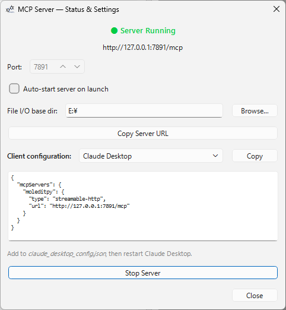
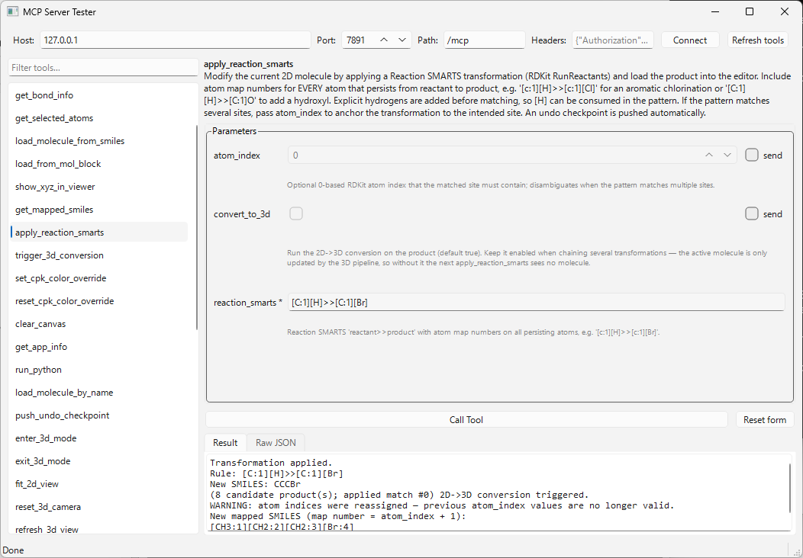

# MoleditPy MCP Server Plugin

Expose [MoleditPy](https://github.com/HiroYokoyama/python_molecular_editor) to AI assistants via the [Model Context Protocol (MCP)](https://modelcontextprotocol.io).

Once running, any MCP-compatible client — **Claude Desktop**, **Claude Code**, **Cursor**, **Windsurf**, **Zed**, **VS Code (Copilot)**, **OpenAI Codex CLI**, **Google Antigravity**, or any HTTP client — can query and control the molecular editor in real time.

[](https://github.com/HiroYokoyama/moleditpy-mcp_server/actions/workflows/test.yml)

[](https://github.com/HiroYokoyama/moleditpy-mcp_server/releases)
[](https://pypi.org/project/mcp-gui-tester/)
[](https://doi.org/10.5281/zenodo.21289092)



---

## What you can do with this

### Molecule editing and analysis

Ask an AI to load, modify, and analyze molecules entirely through conversation:

- **Load by name** — "Load caffeine" → PubChem lookup → molecule appears in the editor
- **Query the current molecule** — get SMILES, formula, MW, atom/bond tables, 3D coordinates
- **Edit atoms and bonds** — run arbitrary RDKit code via `run_python` with full access to the molecule
- **3D visualization** — trigger 2D→3D conversion, switch to 3D viewer, highlight specific atoms or bonds in color, fit/reset the camera
- **Undo-safe editing** — every change can push an undo checkpoint; the user can always revert

### DFT / QM input file generation

Use the AI as a smart input file generator:

- **Generate ORCA, Gaussian, NWChem, … inputs** from the current geometry
- **Write files directly to disk** — the AI calls `write_file_with_xyz_block` (coordinates come straight from the live molecule) or `write_text_file` into a sandboxed directory you configure
- **Read files back** — verify what was written, or load a computed result (`.xyz`, `.log`, …)
- **Organize jobs** — `list_directory`, create subdirectories, delete obsolete files

Example prompt: *"Generate an ORCA input for B3LYP/def2-TZVP geometry optimization of the current molecule and save it to `opt.inp`."*

### Plugin authoring

The AI can read the MoleditPy source and write new plugins for you:

1. `get_plugin_dev_manual` — fetch the full Plugin Development Manual V4 from the web
2. `list_app_source_tree` — get a file map of the installed moleditpy package
3. `get_app_source` — read any source file (e.g. `plugins/plugin_interface.py`) to understand the exact API
4. `write_text_file` (pointed at the plugin directory) — write the plugin code
5. `reload_plugins` — activate the new plugin without restarting MoleditPy

Example prompt: *"Write a MoleditPy plugin that adds a menu item to export the current molecule as a TURBOMOLE `coord` file."*

### Scripting and automation

`run_python` lets the AI execute any Python on MoleditPy's Qt main thread with full `PluginContext` access. Use it for one-off operations too complex for the built-in tools — RDKit workflows, batch atom edits, custom property calculations — and get stdout, stderr, and a return value back.

---

## Installation

1. **Copy** (or symlink) the `mcp_server/` folder into your MoleditPy plugin directory:

   | Platform | Path |
   |----------|------|
   | Windows | `C:\Users\<You>\.moleditpy\plugins\mcp_server\` |
   | Linux / macOS | `~/.moleditpy/plugins/mcp_server/` |

2. **Restart MoleditPy** (or choose **Plugins → Reload All Plugins**).

3. Choose **Plugins → MCP Server → Status & Settings…** to start the server.

---

## Usage

### Starting the server

Open **Plugins → MCP Server → Status & Settings…**, set the port (default **7891**), and click **Start Server**.

The dialog shows the live server URL and a ready-to-paste configuration snippet.

---

## Connecting MCP clients

The server implements **MCP Streamable HTTP** (`POST /mcp`, protocol version `2024-11-05`).

### Claude Desktop

Add the following to `claude_desktop_config.json` (replace the port if you changed it):

```json
{
  "mcpServers": {
    "moleditpy": {
      "type": "streamable-http",
      "url": "http://127.0.0.1:7891/mcp"
    }
  }
}
```

Restart Claude Desktop. MoleditPy now appears as a connected tool server.

### Claude Code (CLI)

Add the server to your Claude Code MCP configuration:

```json
{
  "mcpServers": {
    "moleditpy": {
      "type": "http",
      "url": "http://127.0.0.1:7891/mcp"
    }
  }
}
```

Or set it per-project in `.claude/settings.json` inside your project folder.

### Cursor

Add to `~/.cursor/mcp.json` (global) or `.cursor/mcp.json` (project):

```json
{
  "mcpServers": {
    "moleditpy": {
      "url": "http://127.0.0.1:7891/mcp"
    }
  }
}
```

### Windsurf

Add to `~/.codeium/windsurf/mcp_config.json` (Windows: `%USERPROFILE%\.codeium\windsurf\mcp_config.json`):

```json
{
  "mcpServers": {
    "moleditpy": {
      "serverUrl": "http://127.0.0.1:7891/mcp"
    }
  }
}
```

### Zed

Add to `~/.config/zed/settings.json` (macOS: `Zed → Settings…`):

```json
{
  "context_servers": {
    "moleditpy": {
      "url": "http://127.0.0.1:7891/mcp"
    }
  }
}
```

### VS Code (GitHub Copilot)

Add to `.vscode/mcp.json` in your workspace (VS Code 1.101+):

```json
{
  "servers": {
    "moleditpy": {
      "type": "http",
      "url": "http://127.0.0.1:7891/mcp"
    }
  }
}
```

### OpenAI Codex CLI

Add to `~/.codex/config.toml` (global) or `.codex/config.toml` (project):

```toml
[mcp_servers.moleditpy]
url = "http://127.0.0.1:7891/mcp"
```

### Google Antigravity

Add to `~/.gemini/antigravity/mcp_config.json` (Windows: `%USERPROFILE%\.gemini\antigravity\mcp_config.json`):

```json
{
  "mcpServers": {
    "moleditpy": {
      "serverUrl": "http://127.0.0.1:7891/mcp"
    }
  }
}
```

### curl / raw HTTP

You can call the server from any HTTP client. Example — list available tools:

```bash
curl -s -X POST http://127.0.0.1:7891/mcp \
  -H "Content-Type: application/json" \
  -d '{"jsonrpc":"2.0","id":1,"method":"tools/list","params":{}}' | python -m json.tool
```

Call a tool:

```bash
curl -s -X POST http://127.0.0.1:7891/mcp \
  -H "Content-Type: application/json" \
  -d '{"jsonrpc":"2.0","id":2,"method":"tools/call","params":{"name":"get_current_molecule","arguments":{}}}' | python -m json.tool
```

Health check:

```bash
curl http://127.0.0.1:7891/health
```

### GUI tester

[](https://pypi.org/project/mcp-gui-tester/) [](https://pypi.org/project/mcp-gui-tester/)



A standalone PyQt6 test client, [`mcp-gui-tester`](mcp_gui_tester/), is included as a separate installable package for interactive debugging. It connects to any MCP server speaking the Streamable HTTP transport, lists the available tools, generates a parameter input form from each tool's `inputSchema` (with required/optional handling, JSON editors for array/object parameters, and enum dropdowns), and shows both the formatted result and the raw JSON-RPC response:

```bash
pip install mcp-gui-tester        # or: pip install -e mcp_gui_tester/ from this repo
mcp-gui-tester                    # defaults to http://127.0.0.1:7891/mcp
mcp-gui-tester --url http://localhost:9000/mcp
```

Host, port, and endpoint path are editable in the GUI, so it can be pointed at other MCP HTTP servers too. See [`mcp_gui_tester/README.md`](mcp_gui_tester/README.md) for details.

### Auto-start

To start the server automatically every time MoleditPy launches, open **Plugins → MCP Server → Status & Settings** and check **Auto-start server on launch**.

---

## AI Skill (SKILL.md) — optional

This repo ships a [`SKILL.md`](SKILL.md) that teaches AI agents *how* to use these tools well: always taking coordinates from the live molecule (never retyping them), checkpointing the undo stack after edits, configuring the file sandbox before writing, ready-made recipes for QM input generation and plugin authoring, and discovering/suggesting installable plugins.

To install it for **Claude Code**, copy the file into a skill directory:

```bash
# Personal (all projects)
mkdir -p ~/.claude/skills/moleditpy-mcp
cp SKILL.md ~/.claude/skills/moleditpy-mcp/SKILL.md

# Or per-project
mkdir -p .claude/skills/moleditpy-mcp
cp SKILL.md .claude/skills/moleditpy-mcp/SKILL.md
```

Claude loads it automatically whenever a task involves the MoleditPy MCP tools. Other agent frameworks that support Anthropic-style skills (a `SKILL.md` with YAML frontmatter) can consume the same file.

---

## Available MCP Tools

### Molecule tools

| Tool | Description |
|------|-------------|
| `get_current_molecule` | SMILES, formula, MW, atom/bond counts, 3D availability |
| `get_molecule_xyz` | 3D XYZ coordinate block (`Element X Y Z` per line) |
| `get_atom_properties` | Per-atom: symbol, Z, charge, hybridization, Hs, radical electrons |
| `get_bond_info` | Full bond table: endpoints and bond type (SINGLE/DOUBLE/TRIPLE/AROMATIC) |
| `get_selected_atoms` | Indices and symbols of user-selected atoms |
| `load_molecule_from_smiles` | Draw a molecule from a SMILES string |
| `load_from_mol_block` | Load a molecule from a MOL/SDF block |
| `load_molecule_by_name` | Look up by common/IUPAC name on PubChem and load (e.g. `"aspirin"`) |
| `show_xyz_in_viewer` | Display an XYZ block in the 3D viewer |
| `get_mapped_smiles` | SMILES with atom indices embedded as map numbers + legend (find atom_index targets) |
| `apply_reaction_smarts` | Modify the 2D molecule with a Reaction SMARTS transformation (optional anchor atom) |
| `trigger_3d_conversion` | Run MoleditPy's built-in 2D→3D optimizer (ETKDG/MMFF) |
| `set_cpk_color_override` | Override atom CPK colors in the 3D viewer (hex per atom index); persists across redraws (formerly `highlight_atoms`, still accepted) |
| `reset_cpk_color_override` | Clear atom/bond color overrides (`scope`: atoms / bonds / all) and restore default colors |
| `set_bond_color_override` | Override bond colors in the 3D viewer by bond index or `"atom1-atom2"` pairs; persists across redraws (formerly `highlight_bonds`, still accepted) |
| `push_undo_checkpoint` | Push the current state onto MoleditPy's undo stack |
| `enter_3d_mode` | Switch the UI to 3D viewer mode |
| `exit_3d_mode` | Switch the UI back to 2D editing mode |
| `fit_2d_view` | Fit all visible items in the 2D editor canvas into the viewport |
| `reset_3d_camera` | Reset and re-center the 3D camera |
| `refresh_3d_view` | Force a redraw of the 3D scene |
| `check_chemistry` | Trigger MoleditPy's valence-violation validation pass |
| `refresh_ui` | Sync info panel, undo/redo state, and title bar |
| `clear_canvas` | Clear the 2D editor (undo-safe) |
| `get_app_info` | MoleditPy version and MCP plugin version |
| `run_python` | Execute arbitrary Python on the Qt main thread with `ctx` access — see below |

### Plugin authoring tools

| Tool | Description |
|------|-------------|
| `get_plugin_dev_manual` | Fetch the Plugin Development Manual V4 from the web |
| `list_app_source_tree` | Recursive file tree of the installed moleditpy package (with sizes) |
| `get_app_source` | Read a source file or list a directory within the package |
| `get_plugin_dir` | Return the absolute path to the plugin directory |
| `reload_plugins` | Re-scan and reload all plugins (activates freshly written plugins) |
| `list_available_plugins` | Fetch the official plugin registry and list installable plugins (optional `search` filter) |
| `open_plugin_installer` | Open the in-app Plugin Installer window to install a suggested plugin; if the installer plugin is absent, directs the user to the [Plugin Explorer](https://hiroyokoyama.github.io/moleditpy-plugins/explorer/) for a manual download |

### File I/O tools (sandboxed)

| Tool | Description |
|------|-------------|
| `write_file_with_xyz_block` | **Preferred for QM input generation** — write a file composed as header + live XYZ coordinate block + footer, with `element_style`, `atom_order`, `precision`, and standard-XYZ-header options |
| `write_text_file` | Write text to a file; auto-creates parent dirs; `overwrite=false` by default |
| `read_text_file` | Read a file's UTF-8 text content (≤ 4 MB) |
| `list_directory` | List files and subdirectories with sizes |
| `delete_file` | Delete a file; requires explicit `confirm=true` |
| `get_file_io_config` | Show current base directory and allowed extension list |
| `set_file_io_config` | Set the sandbox directory and/or update the extension allowlist |

#### `run_python` — execute arbitrary Python

`run_python` lets an AI run any Python code on the Qt main thread with full access to MoleditPy's `PluginContext` as `ctx`. Use it for complex RDKit operations, custom manipulations, or reading/pushing molecules back into the editor:

```python
# Example: add an isotope label to atom 0 and reload
from rdkit import Chem
mol = ctx.current_molecule
mol.GetAtomWithIdx(0).SetIsotope(13)
ctx.current_molecule = mol
ctx.push_undo_checkpoint()
ctx.refresh_ui()
result = mol.GetNumAtoms()
```

stdout, stderr, and the value of `result` are returned to the AI. There are no extra sandbox restrictions beyond running inside MoleditPy's process — treat it as a trusted power tool.

#### Security model

All file operations are restricted to a **base directory** you configure. Set it in **Plugins → MCP Server → Status & Settings** (File I/O base dir field), or let the LLM set it via `set_file_io_config`:

```
Set the file I/O base directory to /home/you/dft_jobs
```

Security guarantees:
- **Path traversal blocked** — `../../etc/passwd` and absolute paths are rejected; every path is resolved and must stay within the base directory.
- **Extension allowlist** — only extensions on the allowed list can be written/read/deleted. Defaults cover common DFT/QM formats (`.inp`, `.xyz`, `.gjf`, `.mol`, `.pdb`, `.txt`, `.json`, …). Use `set_file_io_config` to customise.
- **Overwrite protection** — `write_text_file` refuses to replace existing files unless `overwrite=true` is passed explicitly.
- **Deletion requires confirmation** — `delete_file` requires `confirm=true` in the same call.
- **Size limit** — reads and writes are capped at 4 MB.

#### Typical DFT workflow example

> "Generate an ORCA input file for the current molecule using B3LYP/def2-TZVP and save it to `ethanol_opt.inp`."

The LLM will:
1. Call `get_current_molecule` (and `trigger_3d_conversion` if there is no 3D geometry yet).
2. Call `write_file_with_xyz_block` with `path="ethanol_opt.inp"`, `header=["! B3LYP def2-TZVP Opt", "* xyz 0 1"]`, and `footer=["*"]` — the coordinate block is inserted directly from the live molecule, so nothing is retyped.
3. Optionally call `read_text_file` to confirm what was written.

#### Typical plugin authoring workflow

> "Write a MoleditPy plugin that adds a menu item to copy the current SMILES to the clipboard."

The LLM will:
1. Call `get_plugin_dev_manual` to read the full API.
2. Call `list_app_source_tree` to map the source, then `get_app_source "plugins/plugin_interface.py"` for the exact contract.
3. Call `get_plugin_dir` to find the plugin directory.
4. Call `set_file_io_config` to point the sandbox at the plugin directory.
5. Call `write_text_file` with `path="smiles_copy/__init__.py"` and the generated plugin code.
6. Call `reload_plugins` to activate it — the new menu item appears immediately.

---

## Architecture

```
mcp_server/
├── __init__.py   — Plugin entry point (initialize, MCPServerPlugin)
├── bridge.py     — Thread-safe Qt signal bridge (server thread → Qt main thread)
├── server.py     — HTTP server implementing MCP Streamable HTTP transport
└── ui.py         — Status & Settings dialog
```

**Thread safety** — All PluginContext calls must occur on the Qt main thread. `MCPBridge` achieves this by emitting a `QueuedConnection` signal from the server thread; the main thread executes the operation and signals completion via a `threading.Event`.

**No extra dependencies** — Uses only Python's built-in `http.server` and `threading`.

---

## Development

```bash
# Install test dependencies
pip install pytest pytest-cov

# Run tests
pytest tests/ -v

# Run with coverage
pytest tests/ --cov=mcp_server --cov-report=term-missing
```

Tests run fully headlessly — no GUI, no RDKit, no MoleditPy installation required.

---

## Compatibility

| Requirement | Version |
|-------------|---------|
| MoleditPy | ≥ 4.0.0, < 5.0.0 |
| Python | 3.11+ |
| MCP protocol | 2024-11-05 (Streamable HTTP) |

No extra pip dependencies — uses Python's built-in `http.server` and `threading`.
